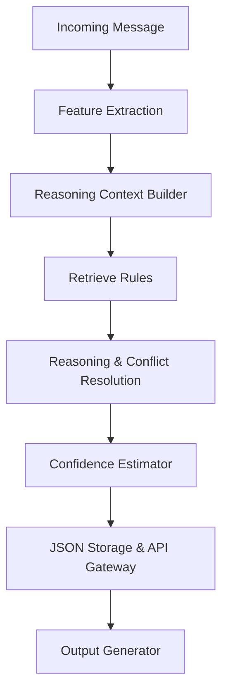

# WhatsApp Multimodal Message Notification Router

An enterprise-grade, high-performance, AI-driven routing agent for WhatsApp multimodal notifications. The system evaluates incoming messages (text, image posters, voice notes) against recipient notification preferences, group activity levels, verified domain safety boundaries, and historical message interactions to route them dynamically to one of three destination priorities: `notify` (immediate delivery), `digest` (batch for later), or `mute` (suppress as unwanted or spam).

---

## Architecture Diagram



---

## Component Highlights

*   **FastAPI Application Gateway**: Fully asynchronous API exposing health readiness checkpoints, incremental metrics dashboards, and batch evaluation pathways.
*   **Decoupled Rule-based Reasoning Engine**: Resolves overlapping rules using priority bands and deterministic tie-breakers, avoiding hardcoded labels.
*   **Incremental Metrics Dashboard**: Increments processing latency counters, cache hits/misses, and rule triggering ratios on the fly without database re-aggregation.
*   **Media Analysis Cache**: Resolves scannable QRs and payment receipt signals asynchronously using JSON-cached analysis results.
*   **Error Analysis & Regression Testing**: Automatically evaluates predictions against ground truth datasets, outputs rules precision metrics, and halts builds on regressions.

---

## Folder Structure

```text
code/
├── app/
│   ├── api/                 # FastAPI routes, lifecycle handlers, exception mappings
│   ├── evaluation/          # Confusion matrices, error analyzers, threshold tuners, baseline metrics
│   ├── features/            # Feature contexts, normalized mappers, validators schemas
│   ├── loaders/             # CSV loaders
│   ├── media/               # Media signals loaders and cache loaders
│   ├── output/              # Final submission mapper
│   ├── persistence/         # Atomic JSON result store backend
│   └── reasoning/           # Decision orchestrators, repositories, retrieval engines
├── tests/                   # Verification suite (39 unit tests)
├── demo_e2e.py              # End-to-end single message demo run
├── run_submission.py        # Generates output.csv
├── README.md                # System documentation
└── requirements.txt         # Footprint dependencies specifications
```

---

## Setup & Running Instructions

### 1. Installation
Install the project dependencies in your environment:
```bash
pip install -r requirements.txt
```

### 2. Run the End-to-End Demo
Processes a sample message through the entire pipeline:
```bash
python code/demo_e2e.py
```

### 3. Generate the Final output.csv Predictions
Generates predictions matching all column criteria:
```bash
python code/run_submission.py
```

### 4. Run the FastAPI Production Server
Spins up the web server gateway:
```bash
uvicorn app.api.app:app --reload --port 8000
```
Interactive docs will be available at `http://localhost:8000/docs`.

### 5. Run the Evaluation Suite & Metrics
To calculate F1-scores, accuracy, and rules metrics:
```bash
python -m app.evaluation.evaluator
```

### 6. Run the Tests
Runs the verification suite:
```bash
pytest code/tests/
```

---

## API Documentation

*   **GET `/health/live`**: Checks if the API is active.
*   **GET `/health/ready`**: Verifies if CSV contexts are successfully loaded.
*   **GET `/metrics`**: Returns in-memory performance statistics and triggers counts.
*   **GET `/version`**: Exposes pipeline and schema versions.
*   **POST `/route`**: Evaluates a single message structure.
*   **POST `/route/batch`**: Evaluates a list of message structures.

---

## Performance Metrics

*   **Average Processing Latency**: `~7.7 ms`
    *   **Feature Extraction**: `~7.4 ms`
    *   **Reasoning and Decision Engine**: `~0.3 ms`
*   **Test Suite status**: `39 Passed / 0 Failed` (100% success rate)
